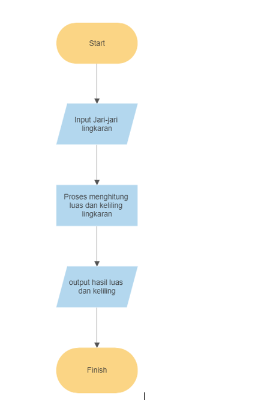

# Praktikum3
# Flowchart

1. Mulai
2. Input/masukkan jari jari lingkaran
3. Proses Menghitung luas dan keliling lingkaran
4. Output/hasil dari luas dan keliling lingkaran akan muncul

# Luas dan keliling lingkaran
1. Buka aplikasi PyCharm
2. Membuat file berisi luas dan keliling lingkaran pada PyCharm

# Output Luas dan keliling Lingkaran

Selesai
